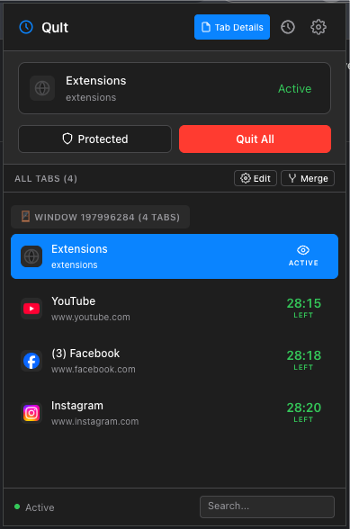

# QuIt-Tabs

> Automatically close inactive browser tabs with elegant macOS-native design

A Chrome extension that automatically closes inactive tabs after a configurable countdown, helping you maintain a clean and organized browser workspace.

<a href="https://chromewebstore.google.com/detail/boahkmlnechnockgjnkgnafllkpajdjm">
    
</a>
</a>

<br />
<br />

## Screenshots



<br />

## ✨ Features

### Smart Tab Management
- ⏱️ **Automatic Countdown** - Tabs start counting down when you leave them
- 📊 **Real-time Display** - See countdown timers for all tabs at a glance
- 🛡️ **Tab Protection** - Protect important tabs from auto-closing with one click
- 🖱️ **Drag-and-Drop** - Reorder tabs or move between windows by dragging
- 🔀 **Merge Duplicates** - One-click to close duplicate tabs (same URL)
- 👆 **Click to Switch** - Click any tab in the list to instantly switch to it

### Tab Groups & Batch Operations
- 📁 **Chrome Tab Groups** - Full visual representation of tab groups with colors
- ✏️ **Edit Mode** - Select multiple tabs with checkboxes for batch operations
- 📦 **Batch Move to Group** - Move selected tabs to any existing tab group
- 🪟 **Batch Move to Window** - Move selected tabs between windows
- 🔓 **Batch Ungroup** - Remove selected tabs from their groups
- 🔍 **Search Tabs** - Quickly filter tabs by title or URL

### QuIt App Integration
Works with [QuIt macOS App](https://github.com/moseiei132/QuIt) for seamless tab management:
- 🔗 **URL Parameters** - Open tabs with auto-grouping via `quit_group` parameter
- 🎨 **Auto-Color Groups** - Set group color via `quit_color` parameter
- 🛡️ **Auto-Protect** - Protect tab via `quit_protect` parameter
- 🔄 **Duplicate Detection** - Prevents opening duplicate tabs from QuIt app
- 🧹 **URL Cleaning** - Automatically removes QuIt parameters after processing

### Media Detection
- 🎵 **Pause on Media** - Don't close tabs playing audio/video
- 🔊 **Visual Indicator** - Shows play icon on tabs with active media

### Tab Protection
Protect tabs from auto-closing with a single click:

- 🛡️ **Shield Icon** - Click "Protected" button to toggle protection
- ⏸️ **Frozen Countdown** - Protected tabs show shield icon and paused timer
- 🔄 **Quick Toggle** - Easy on/off protection in the popup

### History
- 📜 **Closed Tabs Log** - View closed tabs in the popup History panel
- 📊 **Close Reasons** - See % breakdown (timeout / manual / batch) at a glance
- 🔄 **Restore Tabs** - One-click restore for any accidentally closed tab
- 🧹 **Privacy Control** - Clear history at any time; data stays local

### Advanced Features
- 🎨 **Native macOS Design** - Beautiful light/dark mode support
- 👁️ **Current Tab Toggle** - Show/hide current tab section with eye icon
- 📌 **Pinned Tab Support** - Optionally include pinned tabs in countdown

## 🖥️ Supported Browsers

**All Chromium-based browsers** (uses Chrome Extension Manifest V3):
- ✅ Google Chrome
- ✅ Microsoft Edge
- ✅ Brave
- ✅ Opera
- ✅ Vivaldi
- ✅ Arc
- ✅ Any other Chromium browser

**Coming soon:**
- 🔜 Firefox (requires minor API adjustments)
- 🔜 Safari (requires conversion tool)

## 📦 Installation

### From Source

1. **Clone the repository**
   ```bash
   git clone https://github.com/moseiei132/QuIt-Tabs.git
   cd QuIt-Tabs
   ```

2. **Load in Chrome**
   - Open Chrome and navigate to `chrome://extensions/`
   - Enable "Developer mode" (top right)
   - Click "Load unpacked"
   - Select the `QuIt-Tabs` folder

3. **Start using!**
   - Click the extension icon in your toolbar
   - Configure your preferred countdown time
   - Click "Protected" on any tab you want to keep

## 🎯 Usage

### Basic Setup

1. **Configure Global Countdown**
   - Click the extension icon
   - Go to Settings
   - Set your preferred countdown time (default: 5 minutes)

2. **Protect Important Tabs**
   - Navigate to a page you want to protect
   - Click the extension icon
   - Click "Protected" button (shield icon)
   - Tab will show shield and stop counting down

### Understanding Tab States

- **Active** - Currently viewing (no countdown)
- **4:59** - Counting down, will close in 4 minutes 59 seconds
- **🛡️** - Protected (countdown paused)
- **⏸** - Media playing (auto-paused)

## ⚙️ Settings

### General Settings
- **Enable Extension** - Turn on/off auto-closing
- **Global Countdown** - Default time before closing (1-60 minutes)
- **Auto-close Pinned Tabs** - Include pinned tabs in countdown
- **Pause on Media** - Don't close tabs playing audio/video

## 🛠️ Development

### Built With
- Chrome Extension Manifest V3
- Vanilla JavaScript (no frameworks)
- macOS native design system
- Web Extensions API

### Project Structure
```
QuIt-Tabs/
├── manifest.json          # Extension manifest (V3)
├── background.js          # Service worker - tab states, countdown, alarms
├── popup/                 # Extension popup
│   ├── popup.html         # Main popup UI
│   ├── popup.js           # Main entry point, initialization
│   ├── popup.css          # Popup styling
│   ├── icons.svg          # SVG icon sprites
│   └── modules/           # Modular JavaScript
│       ├── state.js       # Global state management
│       ├── utils.js       # Utility functions (formatTime, escapeHtml, etc.)
│       ├── tabs.js        # Tab loading, rendering & list management
│       ├── currentTab.js  # Current tab display & countdown
│       ├── batchActions.js # Batch operations (move, close, protect)
│       ├── dragDrop.js    # Drag-and-drop (Sortable.js)
│       ├── contextMenu.js # Right-click context menus
│       ├── tabGroups.js   # Tab group management
│       ├── settings.js    # Settings panel & per-site timeouts
│       ├── history.js     # In-popup closed-tabs history
│       └── events.js      # Event listeners setup
├── utils/                 # Shared utilities
│   ├── storage.js         # Settings and state persistence
│   └── quit-integration.js # QuIt app URL parameter handling
├── lib/                   # Third-party libraries
└── icons/                 # Extension icons
```

### Key Files
- **background.js** - Manages tab states, countdown logic, alarm handling, QuIt integration
- **popup/popup.js** - Main entry point, orchestrates modules
- **popup/modules/** - Modular JavaScript components:
  - `state.js` - Global state management
  - `tabs.js` - Tab rendering and list management
  - `dragDrop.js` - Sortable.js drag-and-drop logic
  - `contextMenu.js` - Right-click context menus
- **utils/storage.js** - Settings and state persistence
- **utils/quit-integration.js** - Handles QuIt app URL parameters

## 🎨 Design Philosophy

QuIt-Tabs follows macOS native design principles:
- SF Pro font family
- Adaptive light/dark mode
- Subtle shadows and borders
- Smooth animations
- Clean, minimalist interface

## 📝 License

MIT License - see [LICENSE](LICENSE) file for details

## 🔗 Related Projects

Part of the QuIt ecosystem:
- [QuIt](https://github.com/moseiei132/QuIt) - macOS app for automatically quitting inactive applications

## 👨‍💻 Author

**moseiei132** - [GitHub](https://github.com/moseiei132)

## 🙏 Acknowledgments

Inspired by the need to maintain focus and reduce browser clutter during deep work sessions.

---

**Note:** This extension only starts counting down when you leave a tab. Active tabs are never closed, ensuring you never lose your current work.
